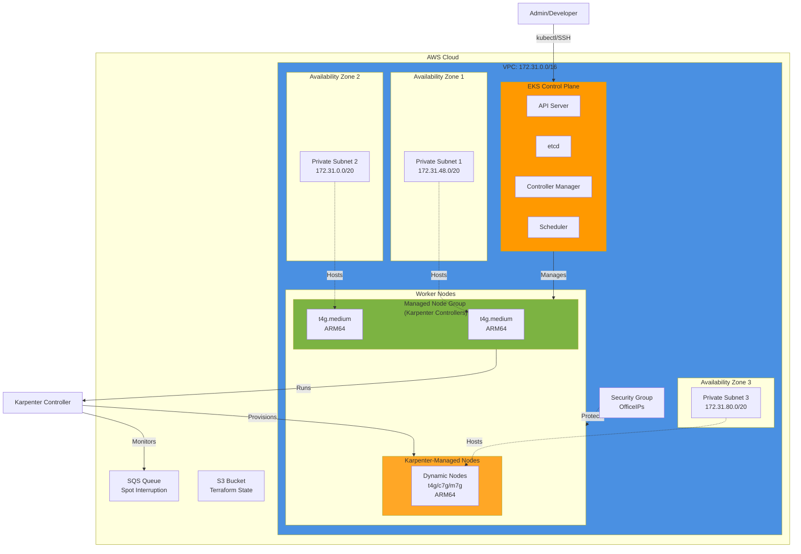
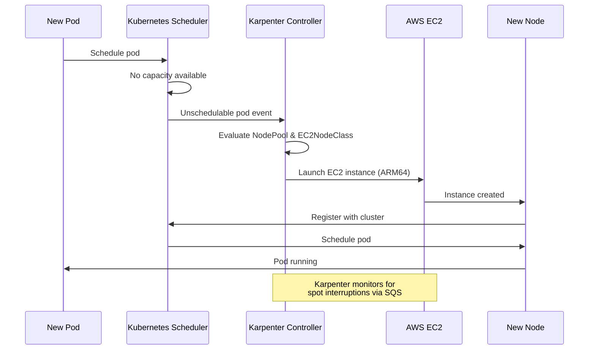
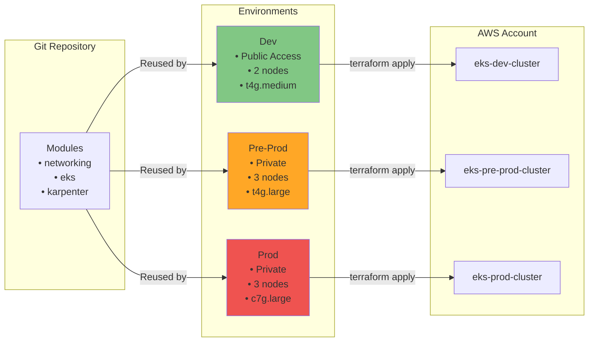
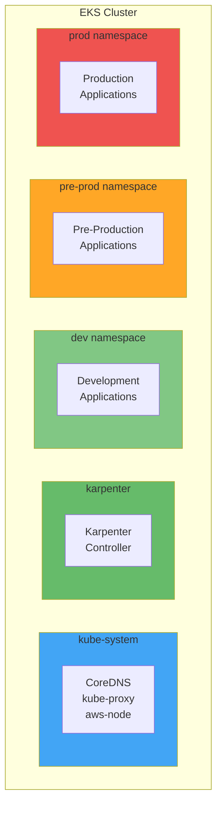
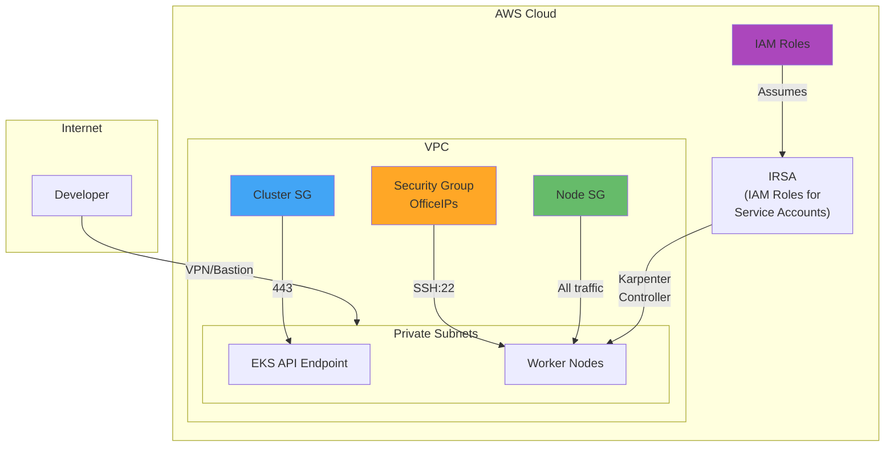
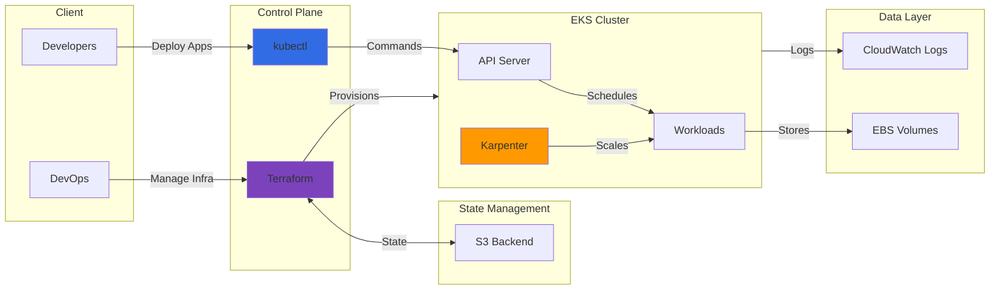
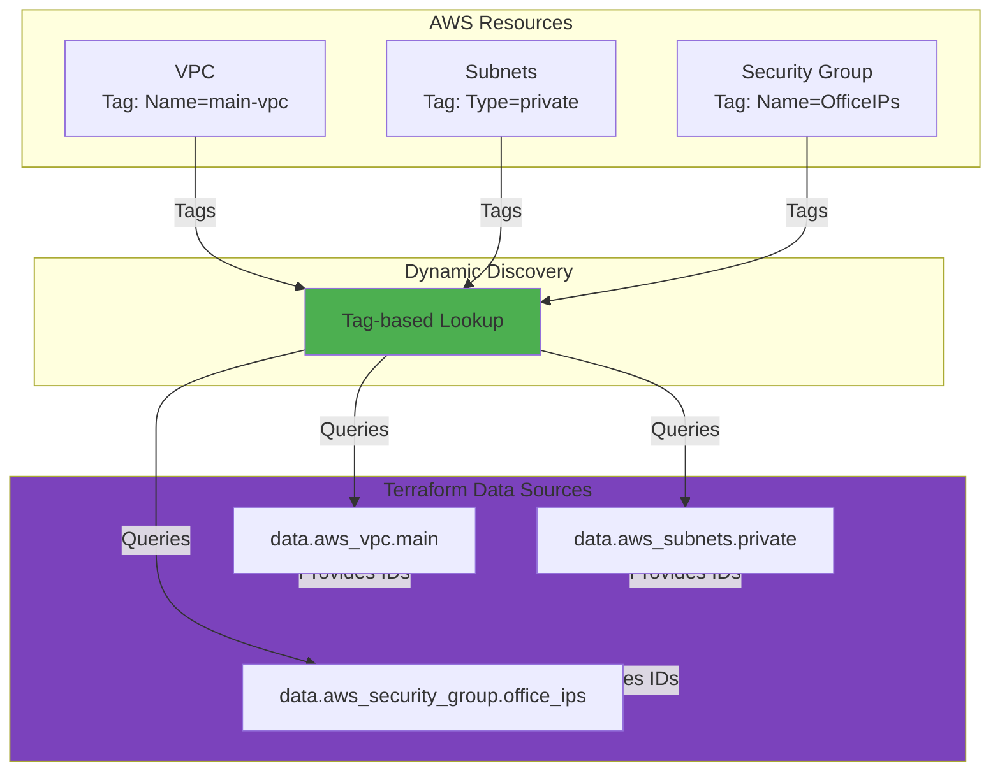

# EKS Architecture Diagram

This document contains architecture diagrams for the EKS deployment.

## Infrastructure Architecture

## Karpenter Workflow

## Multi-Environment Deployment

## Namespace Organization

## Security Architecture

## Data Flow

## Resource Tagging Strategy

